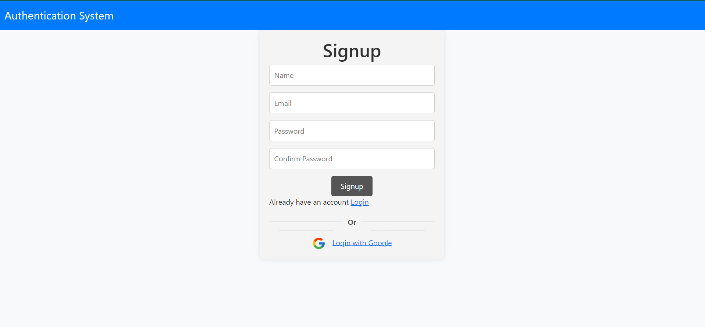
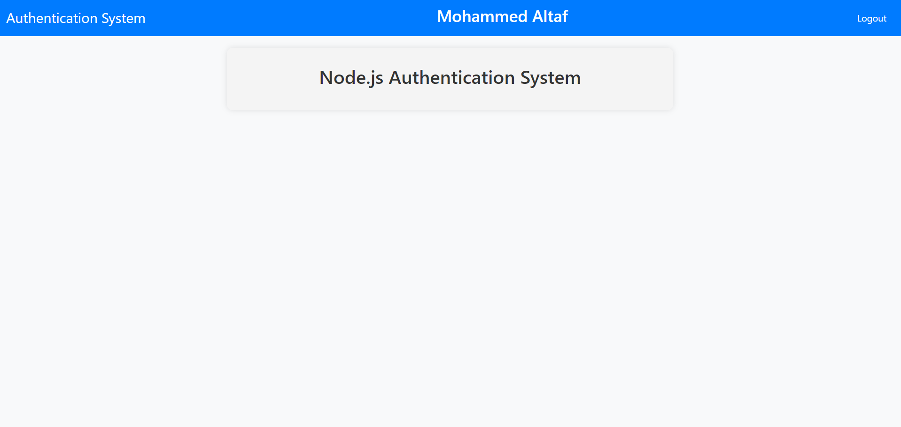

# Node.js Authentication System

This project is a simple authentication system implemented using Node.js, Express, MongoDB, and Passport. It provides user signup, login, password reset, and Google OAuth2 authentication functionalities.





## Table of Contents

- [Features](#features)
- [Technologies Used](#technologies-used)
- [Installation](#installation)
- [Usage](#usage)
- [Folder Structure](#folder-structure)
- [Configuration](#configuration)

## Features

- User Signup
- User Login (Local and Google OAuth2)
- Password Reset
- Flash Messages for User Feedback
- EJS Layouts for Consistent UI
- MongoDB for Database

## Technologies Used

- Node.js
- Express
- MongoDB
- Passport (Local Strategy and Google OAuth2 Strategy)
- EJS (Embedded JavaScript) for Views
- Express EJS Layouts
- Bootstrap (for basic styling)
- Noty (for flash messages)

## Installation

1. Clone the repository:

   ```bash
   git clone https://github.com/raza-altaf/NodejsAuth.git
   ```

2. Install dependencies:

   ```bash
   cd node-authentication-system
   npm install
   ```

3. Set up MongoDB:

   - Create a MongoDB database and obtain the connection string.
   - Replace the `MONGODB_URL` in the `.env` file with your MongoDB connection string.

4. Set up Google OAuth2:

   - Create a Google Developers Console project and enable the Google+ API.
   - Obtain the Client ID and Client Secret.
   - Replace the Google OAuth2 credentials in the `passport-google-oauth2-stretegy.js` file.

5. Start the server:

   ```bash
   npm start
   ```

6. Open your browser and navigate to [http://localhost:3000](http://localhost:3000).

## Usage

- Visit [http://localhost:3000](http://localhost:3000) in your browser.
- Sign up for a new account or log in using existing credentials.
- Use the provided features like password reset and Google OAuth2 login.

## Folder Structure

```
node-authentication-system/
|-- assets/
|-- config/
|-- controllers/
|-- models/
|-- routes/
|-- views/
|-- .env
|-- app.js
|-- package.json
|-- README.md
|-- ... (other files and folders)
```

- **assets:** Static assets like stylesheets and images.
- **config:** Configuration files, including database and passport strategies.
- **controllers:** Controllers handling routes and business logic.
- **models:** Mongoose models for MongoDB.
- **routes:** Express route handlers.
- **views:** EJS view templates.
- **.env:** Environment variables (create this file).
- **app.js:** Main entry point for the application.
- **package.json:** Node.js project configuration.

## Configuration

- **Environment Variables (.env):**

  ```
  PORT=3000
  MONGODB_URL=your-mongodb-connection-string
  GOOGLE_CLIENT_ID=your-google-client-id
  GOOGLE_CLIENT_SECRET=your-google-client-secret
  ```

## Contribution

Contributions are welcome! If you find a bug or have an idea for an improvement, feel free to open an issue or submit a pull request.
